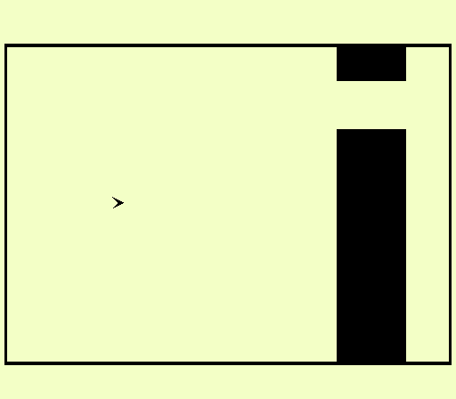

Noisy Flappy Bird

Author: Xuyang Fang

Design: Add different environments in Flappy birds, including slippery ice, blue seas, muddy ground with high resistence. Be care ! There will by noisy warning before environment changes. Different environments have different gravity and background music. There will be special sounds when the bird flies up or down or crashes.
Screen Shot:

How To Play:

Click left to go up, click right to go down.

Sources:

Use some free online tools to convert and cut the music resources.

https://www.aconvert.com/audio/split/

https://audio.online-convert.com/convert-to-wav

All music resouces come from  https://freepd.com

Rafael Krux :

Horror Suspense,
Happy Whistling Ukulele,
Inspiration,
Advertising,
Ukulele Song

Brian Boyko :

Ambush in Rattlesnake Gulch

This game was built with [NEST](NEST.md).
